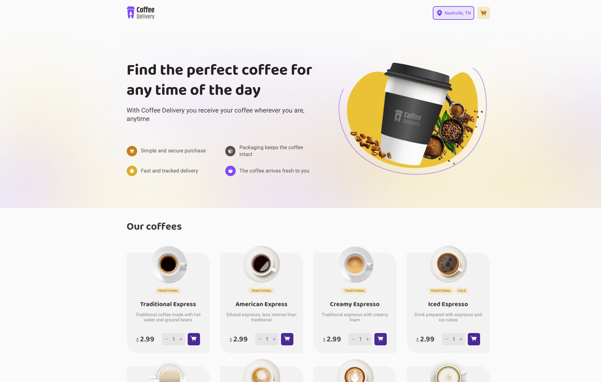
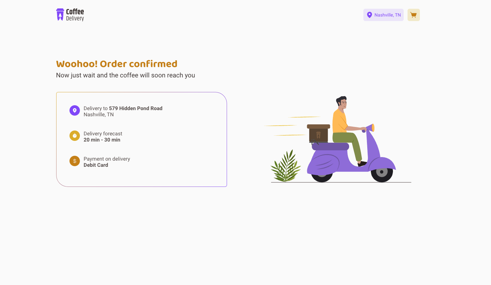

### Challenge 02 - Coffee Delivery





#### 💻 Getting started

Coffee Shop application created with Vite + React.

Follow the steps below:
```bash
# Project dependencies
$ npm i

# Start the app
$ npm run dev
```

The application will be initialized on the port: `5173`

#### 🔗 Challenge link
https://efficient-sloth-d85.notion.site/Desafio-02-Coffee-Delivery-30e42a21fdb44b09a85244fc2c3dbdf9
